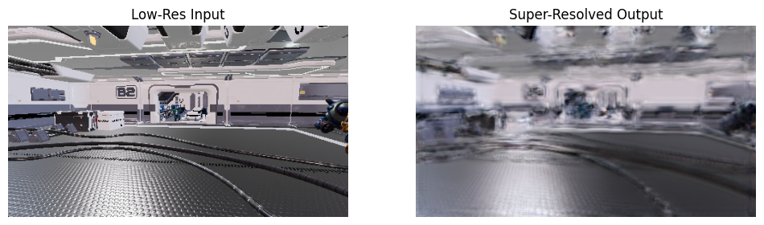

# DLSS-Clone: Deep Learning Super Sampling Prototype

> A PyTorch-based experimental clone of DLSS for real-time game frame super-resolution.

## Overview

This project is an implementation of a deep learning-based image super-resolution (SR) model that mimics NVIDIA's DLSS. It is trained on a high-quality gaming dataset to upscale low-resolution rendered frames into high-resolution outputs.

Inspired by the paper:

- [Efficient Neural Supersampling on a Novel Gaming Dataset (ICCV 2023)](https://openaccess.thecvf.com/content/ICCV2023/papers/Mercier_Efficient_Neural_Supersampling_on_a_Novel_Gaming_Dataset_ICCV_2023_paper.pdf)

## Example (WIP)


## Dataset

The model is trained using the **Qualcomm Rasterized Images Dataset (QRD)**:

- 📦 [Download here](https://www.qualcomm.com/developer/software/qualcomm-rasterized-images-dataset)

Expected folder structure after extracting:

```
qrd_data/
├── 270p/
│ └── Native/
│   └── 0002/
│     └── 0002.png
└── 1080p/
  └── Native/
    └── 0002/
      └── 0002.png
```

## 🧠 Model

The current model is a simplified residual network with pixel shuffle upsampling:

- Entry convolution
- 8 residual blocks
- PixelShuffle for 2× upscaling
- Final convolution

---
## 🚀 Getting Started

### 1. Set up virtual environment

```bash
python -m venv venv
source venv/bin/activate   # Linux/macOS
# venv\Scripts\activate     # Windows
```

### 2. Install dependencies
```
pip install -r requirements.txt
```
### 3. Train the model
```
python train.py
```
- Trains for 100 epochs
- Saves models every 10 epochs
- Stores sample outputs in output/

### 4. Testing

Run the test notebook in VS Code or Jupyter:
```
jupyter notebook test_notebook.ipynb
```

## 📘 References

- [ICCV 2023 Paper: Efficient Neural Supersampling on a Novel Gaming Dataset](https://openaccess.thecvf.com/content/ICCV2023/papers/Mercier_Efficient_Neural_Supersampling_on_a_Novel_Gaming_Dataset_ICCV_2023_paper.pdf)
- [Qualcomm Rasterized Images Dataset](https://www.qualcomm.com/developer/software/qualcomm-rasterized-images-dataset)
- [PixelShuffle (ESPCN) Paper](https://arxiv.org/abs/1609.05158)

---

## 🛑 License

MIT License. Please give credit to Cole Chiodo if you use this project.